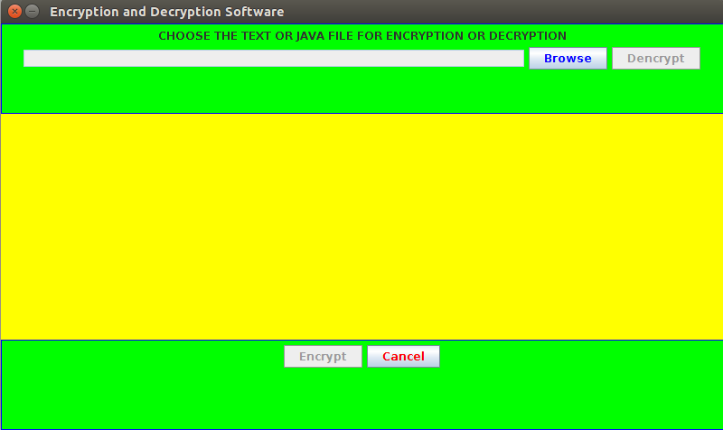
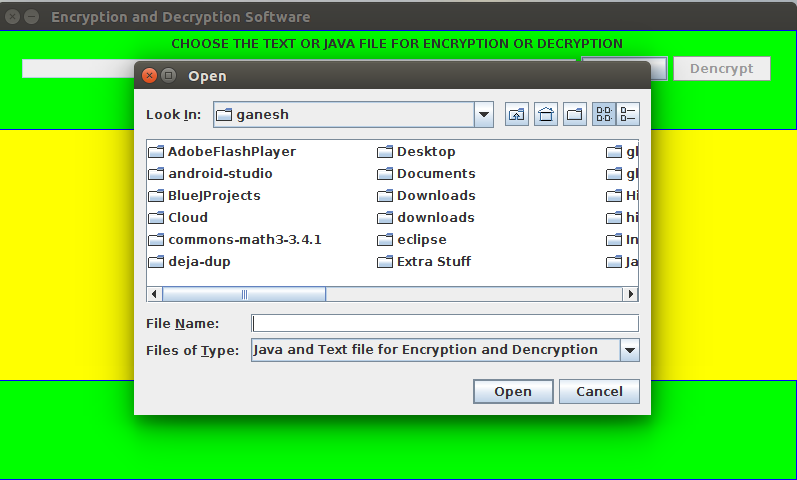
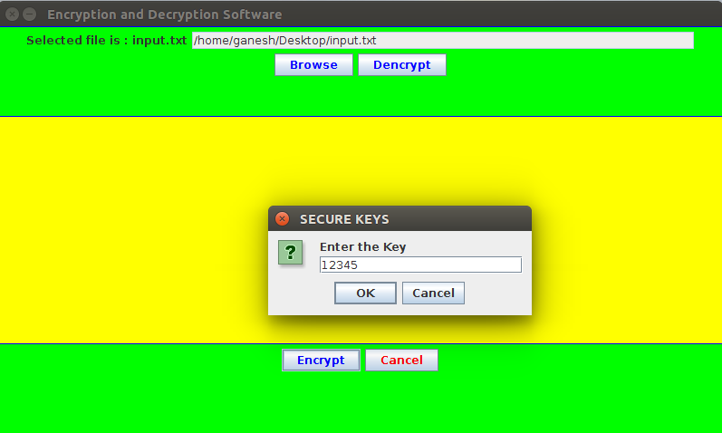
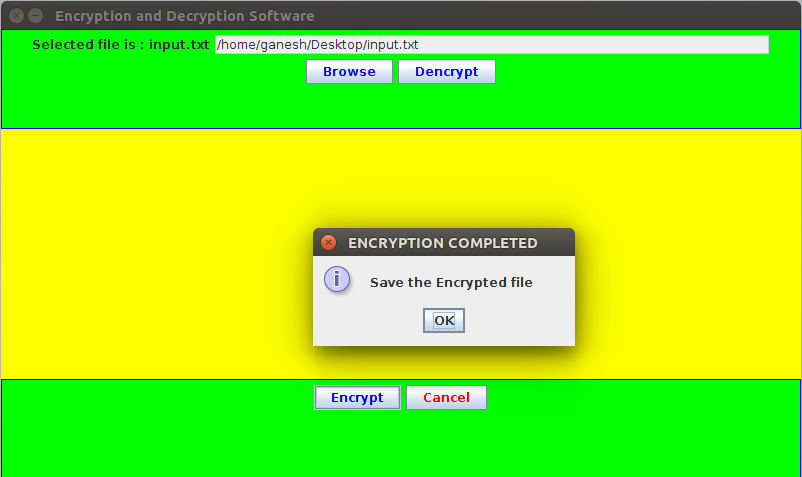
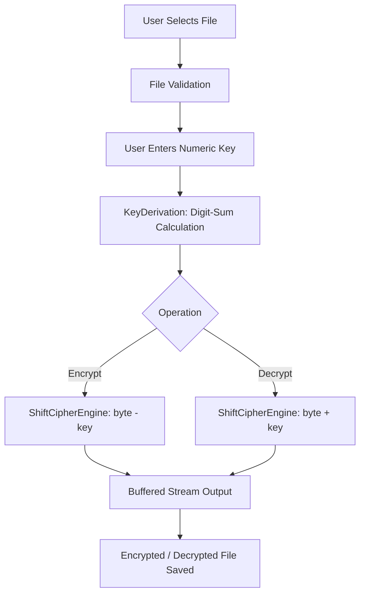

# Encryption System

[](LICENSE)
[](https://www.oracle.com/java/)
[](https://maven.apache.org/)

An educational desktop file encryption and decryption application developed in Java. The project provides a graphical user interface (GUI) to transform `.txt` text files and `.java` source code files into obfuscated ciphertext and back using a byte-level shift cipher.

Created by **Adarsh Aher** as a practical learning project during a Network Security course to explore fundamental concepts of cryptography, byte manipulation, and Java Swing GUI development.

---

## Overview

Encryption System demonstrates how data transformation functions at the byte level. It provides:
- A user-friendly desktop GUI for selecting files and setting encryption keys.
- Stream-based file transformation capable of handling arbitrary file sizes without memory exhaustion.
- Reversible byte-shift transformation based on digit-sum key derivation.

---

## Screenshots

| Main Interface | File Selection |
| :---: | :---: |
|  |  |

| Key Entry | Completed Encryption |
| :---: | :---: |
|  |  |

---

## Features

- **Intuitive GUI**: Built with Java Swing with native OS look-and-feel.
- **File Chooser Integration**: Browse and select `.txt` documents and `.java` source files.
- **Streaming Architecture**: Low memory footprint using buffered I/O streams; handles large files seamlessly.
- **Digit-Sum Key Derivation**: Derives an integer shift value from user-provided numeric passwords.
- **Safe File Saving**: Automatically manages file extensions (`.enc`, `.txt`, `.java`) and prompts before overwriting existing files.
- **Robust Error Handling**: Validates user inputs, reports I/O exceptions gracefully, and prevents application crashes.

---

## Technology Stack

- **Language**: Java (JDK 8 or higher)
- **GUI Framework**: Java Swing (`javax.swing`, `java.awt`)
- **Build Tool**: Apache Maven
- **Test Framework**: JUnit 5 Jupiter (`org.junit.jupiter`)

---

## Architecture & Data Flow



### Component Breakdown
- `io.github.adarshh025.encryptionsystem.Main`: Application entry point; initializes native Look-and-Feel and launches UI.
- `io.github.adarshh025.encryptionsystem.core.CipherEngine`: Contract defining streaming and in-memory encryption/decryption.
- `io.github.adarshh025.encryptionsystem.core.ShiftCipherEngine`: Core byte-shift transformation engine.
- `io.github.adarshh025.encryptionsystem.core.KeyDerivation`: Input validation and base-10 digit-sum key calculation.
- `io.github.adarshh025.encryptionsystem.ui.CryptographyFrame`: Swing window handling user interactions, dialogs, and progress states.
- `io.github.adarshh025.encryptionsystem.ui.FileFilters`: File selection filters for text and Java files.

---

## Cryptographic Mechanics

### 1. Key Derivation
When the user enters a numeric password (e.g., `12345`), the system extracts the absolute numeric value and computes the sum of its decimal digits:

$$\text{shift} = \sum_{i} d_i$$

For example, for key `12345`:
$$1 + 2 + 3 + 4 + 5 = 15$$

### 2. Byte Transformation
The cipher operates as a byte-level Caesar/additive cipher:
- **Encryption**: Each byte $b$ is shifted backwards:
  $$c_i = (b_i - \text{shift}) \pmod{256}$$
- **Decryption**: Each ciphertext byte $c$ is restored by adding the shift:
  $$b_i = (c_i + \text{shift}) \pmod{256}$$

---

## Security Considerations

> [!WARNING]
> **Educational Grade Cryptography**:
> This project is designed exclusively for educational and learning purposes. It is **not** intended to protect sensitive, confidential, or production data.

### Known Limitations
1. **Small Key Space**: Since the cipher operates modulo 256, there are at most 256 distinct byte shift states. A brute-force attack can test all possible keys in milliseconds.
2. **Frequency Analysis**: Single-byte additive substitution preserves frequency distributions and byte patterns of the underlying file format.
3. **No Authenticated Encryption**: The format does not include an HMAC or AEAD tag; tampered ciphertext will decrypt into corrupted bytes without raising an authentication error.
4. **Known Plaintext Vulnerability**: Knowledge of standard file headers (e.g. `public class`, `import java.`) immediately discloses the exact key.

---

## Installation & Setup

### Prerequisites
- **Java Development Kit (JDK)**: Version 8, 11, 17, or 21 installed.
- **Apache Maven**: Version 3.6 or higher.

Verify installations:
```bash
java -version
mvn -version
```

### Build from Source
Clone the repository and compile using Maven:
```bash
git clone https://github.com/adarshh025/encryption-project.git
cd encryption-project
mvn clean package
```

This compiles all classes, runs the test suite, and packages an executable JAR into `target/encryption-system-1.0.0.jar`.

---

## Usage

Run the packaged application:
```bash
java -jar target/encryption-system-1.0.0.jar
```

Alternatively, run directly with Maven:
```bash
mvn compile exec:java -Dexec.mainClass="io.github.adarshh025.encryptionsystem.Main"
```

### Command-Line Options
```bash
java -jar target/encryption-system-1.0.0.jar --help
java -jar target/encryption-system-1.0.0.jar --version
```

---

## Running Tests

Execute the automated JUnit 5 test suite:
```bash
mvn test
```

The test suite verifies:
- Key derivation edge cases (multi-digit sums, negative numbers, whitespace, zero/null/invalid inputs).
- ASCII and UTF-8 round-trip encryption/decryption.
- Java source code preservation.
- Binary data and full byte range (0x00 to 0xFF).
- Streaming throughput on large files.
- Exact byte-shift verification.
- Incorrect key behavior.

---

## Project Structure

```
encryption-project/
├── .gitignore                          # Git ignore rules for Maven, IDEs, and OS files
├── LICENSE                             # MIT License
├── README.md                           # Project documentation
├── pom.xml                             # Maven project configuration
├── assets/
│   └── screenshots/                    # UI walkthrough screenshots
│       ├── Encryption1.png
│       ├── Encryption2.png
│       ├── Encryption3.png
│       ├── Encryption4.png
│       ├── Encryption5.png
│       └── Encryption6.png
└── src/
    ├── main/
    │   ├── java/
    │   │   └── io/github/adarshh025/encryptionsystem/
    │   │       ├── Main.java           # Application entry point
    │   │       ├── core/
    │   │       │   ├── CipherEngine.java       # Interface
    │   │       │   ├── KeyDerivation.java      # Key parser & digit sum
    │   │       │   └── ShiftCipherEngine.java  # Streaming Caesar cipher
    │   │       └── ui/
    │   │           ├── CryptographyFrame.java  # Swing interface
    │   │           └── FileFilters.java        # JFileChooser filters
    │   └── resources/
    │       └── io/github/adarshh025/encryptionsystem/
    │           ├── logo.GIF            # UI brand image
    │           └── wait.GIF            # UI loading animation
    └── test/
        └── java/
            └── io/github/adarshh025/encryptionsystem/
                ├── KeyDerivationTest.java      # Key derivation tests
                └── ShiftCipherEngineTest.java  # Cipher roundtrip & edge tests
```

---

## Roadmap & Future Improvements

- [ ] Add modern authenticated encryption mode (AES-256-GCM with PBKDF2 key derivation).
- [ ] Add CLI mode for headless terminal encryption (`encrypt -f input.txt -k 12345 -o output.enc`).
- [ ] Add drag-and-drop file support to the GUI.
- [ ] Support folder/batch file encryption.

---

## License

This project is licensed under the **MIT License**. See the [LICENSE](LICENSE) file for details.

---

## Author

**Adarsh Aher**  
- GitHub: [@adarshh025](https://github.com/adarshh025)
